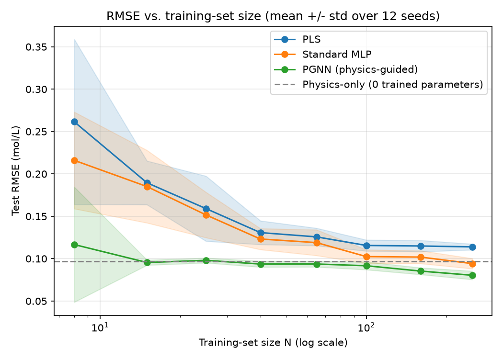
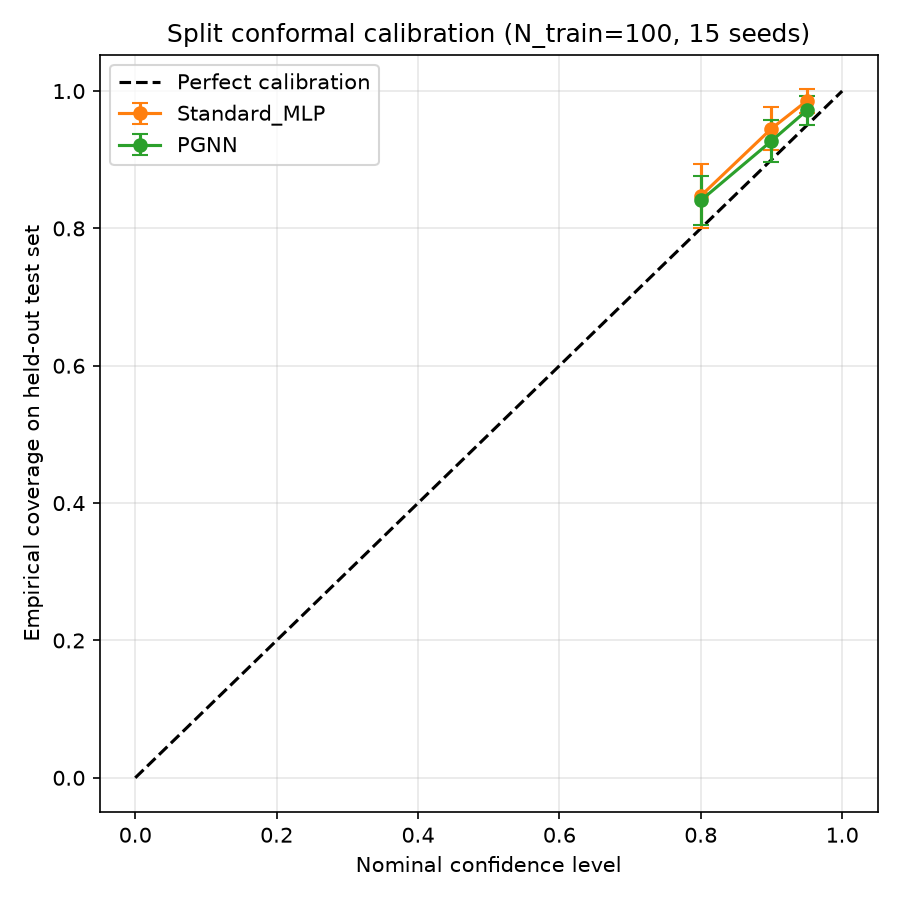

# Physics-Guided Soft Sensing for Nonlinear Chemical Processes

A physics-guided machine learning soft sensor for predicting product concentration in a nonlinear chemical reactor under limited labeled data.

> **Main result:** In the controlled Van de Vusse CSTR simulation, the PGNN achieved substantially lower RMSE than both PLS and the standard MLP across the tested low-data regimes, with the strongest advantage at very small training sizes.


## Overview

In chemical manufacturing, important quality variables such as product concentration may not be measured continuously. Laboratory analysis can introduce delays, while process sensors can continuously measure variables such as feed conditions, flow, and temperature.

This project investigates whether **physics-guided machine learning can improve soft-sensor prediction when only a small amount of labeled quality data is available**.

A nonlinear **Van de Vusse CSTR** is used as a controlled first-principles simulation environment. The project compares:

- **PLS** — a conventional multivariate regression baseline
- **MLP** — a purely data-driven neural-network baseline
- **PGNN** — a Physics-Guided Neural Network that combines data loss with a physics-guidance loss

The study also evaluates the effect of training-data size, process/measurement noise, physics-loss weighting, and prediction uncertainty using **Split Conformal Prediction**.

> This is a controlled simulation study, not a claim of validation on real industrial plant data.

## Main Result

The main experiment evaluates 8 labeled-data sizes, 12 random seeds, and 3 models, producing **288 model-result rows**.



The mean RMSE across the 12 seeds was:

| Labeled samples | PLS RMSE | MLP RMSE | PGNN RMSE |
|---:|---:|---:|---:|
| 8 | 0.2615 | 0.2160 | **0.1167** |
| 15 | 0.1896 | 0.1851 | **0.0955** |
| 25 | 0.1591 | 0.1516 | **0.0980** |
| 40 | 0.1308 | 0.1232 | **0.0937** |
| 65 | 0.1257 | 0.1190 | **0.0937** |
| 100 | 0.1156 | 0.1024 | **0.0916** |
| 160 | 0.1150 | 0.1019 | **0.0853** |
| 250 | 0.1139 | 0.0942 | **0.0804** |

At **8 labeled samples**, the mean PGNN RMSE was approximately **55.4% lower than PLS** and **46.0% lower than MLP**.

At **250 labeled samples**, PGNN remained approximately **29.4% lower than PLS** and **14.6% lower than MLP** by RMSE.

These results come from the controlled simulated experiment and should not be interpreted as real-plant performance.

## Research Question

> **Can physical process knowledge improve neural-network soft-sensor performance when labeled training data is scarce?**

The project is deliberately focused on one nonlinear process so that the process model, ML models, and experiments can be evaluated rigorously rather than adding many loosely validated extensions.

---

## Process: Van de Vusse CSTR

The simulated reactor uses the nonlinear Van de Vusse reaction network:

```text
A → B → C
2A → D
```

The competing reaction pathways create nonlinear steady-state behavior.

The simulated process provides the ground truth needed to evaluate the soft sensor while allowing controlled process and measurement noise to be introduced.

The target quality variable is the concentration of product **B (`CB`)**.

---

## Method

### 1. PLS baseline

Partial Least Squares (PLS) provides a conventional multivariate regression baseline for correlated process measurements.

### 2. Standard MLP

A multilayer perceptron provides a nonlinear, purely data-driven baseline.

### 3. Physics-Guided Neural Network

The PGNN combines prediction loss with a physics-guidance term:

\[
L_{total} = L_{data} + \lambda L_{physics}
\]

where:

- `L_data` measures prediction error against labeled quality measurements.
- `L_physics` penalizes inconsistency with the known process relationships.
- `λ` controls the influence of the physics guidance.

The implementation uses a custom training/backpropagation path so that the physics-guided gradient can be explicitly verified.

The terminology **PGNN (Physics-Guided Neural Network)** is used rather than PINN because the model is performing supervised quality regression with a soft physics-guidance term rather than solving a PDE through the conventional PINN formulation.

---

## Experimental Design

The main experiment evaluates:

- **8 labeled-data sizes:** 8, 15, 25, 40, 65, 100, 160, 250
- **12 random seeds**
- **3 models:** PLS, MLP, PGNN
- **400 held-out test campaigns** for final evaluation

This produces:

**8 × 12 × 3 = 288 model-result rows**

The training-set size is varied to directly study the low-data regime.

### Noise

The simulation distinguishes between:

- **Process noise** — variation in operating conditions
- **Measurement noise** — imperfect sensor measurements

### Physics-loss weight

The physics-loss weight `λ` is selected through cross-validation rather than being chosen using the final test set.

A dedicated λ-sweep experiment is also included at `N=15` and `N=100` across multiple random seeds.

---

## Uncertainty Quantification

The project uses **Split Conformal Prediction** to produce prediction intervals instead of only point predictions.

Example:

```text
Predicted CB = 1.1663 mol/L
90% interval = [0.9638, 1.3688] mol/L
```

In the final prediction demonstration:

- Training data: **60 labeled campaigns**
- Test data: **400 held-out campaigns**
- MAE: **0.0777 mol/L**
- RMSE: **0.0968 mol/L**
- R²: **0.8376**
- Target coverage: **90%**
- Empirical test coverage: **96.0%**
- 90% interval half-width: **0.2025 mol/L**

The 96.0% figure is **empirical coverage**, not "96% accuracy." The project evaluates coverage against the chosen nominal level and documents the assumptions behind conformal prediction.



---

## Validation and Reproducibility

The project includes automated checks for important implementation details.

Verified components include:

- Closed-form Van de Vusse steady-state solution vs numerical ODE integration
- Neural-network gradient correctness using numerical gradient checking
- End-to-end model pipeline
- Basic conformal-prediction properties
- Clean-room reproduction of the experiment
- Reproducible random-seed-based evaluation

The physics verification reached numerical errors on the order of machine precision, and the gradient check passed with a maximum error of approximately `3.75e-05`.

---

## Quick Start

```powershell
python -m venv ss
.\ss\Scripts\Activate.ps1
pip install -r requirements.txt
python tests/test_smoke.py
python scripts/generate_data.py
python scripts/run_main_experiment.py
python scripts/run_lambda_sweep.py
python scripts/run_conformal_experiment.py
python scripts/predict.py
```
---

## Project Structure

```text
softsensor_project/
│
├── data/
│   ├── pool_campaigns.csv
│   └── test_campaigns.csv
│
├── results/
│   ├── plots/
│   └── tables/
│
├── scripts/
│   ├── generate_data.py
│   ├── verify_physics_model.py
│   ├── run_main_experiment.py
│   ├── run_lambda_sweep.py
│   ├── run_conformal_experiment.py
│   └── predict.py
│
├── src/
│   └── project source modules
│
├── tests/
│   └── test_smoke.py
│
├── README.md
└── requirements.txt
```

---

## Installation

Python 3.12.x is recommended.

Create and activate a virtual environment:

```powershell
python -m venv ss
.\ss\Scripts\Activate.ps1
```

Install dependencies:

```powershell
pip install -r requirements.txt
```

The project uses a lightweight scientific Python stack and does not require a GPU.

---

## Reproduce the Experiments

Generate the simulation data:

```powershell
python scripts/generate_data.py
```

Verify the process physics:

```powershell
python scripts/verify_physics_model.py
```

Run the smoke tests:

```powershell
python tests/test_smoke.py
```

Run the main model comparison:

```powershell
python scripts/run_main_experiment.py
```

Run the physics-loss λ sweep:

```powershell
python scripts/run_lambda_sweep.py
```

Run conformal prediction experiments:

```powershell
python scripts/run_conformal_experiment.py
```

Run the prediction demonstration:

```powershell
python scripts/predict.py
```

For detailed methodology and reproducibility instructions, see `BUILD_GUIDE.md` and `RUN_GUIDE.md`.

---

## What the Project Demonstrates

- A nonlinear first-principles chemical-process simulator can provide a controlled environment for soft-sensor research.
- Physics guidance can substantially stabilize neural-network prediction when labeled data is scarce.
- Cross-validated selection of the physics-loss weight avoids simply hand-picking `λ`.
- Split Conformal Prediction can provide empirical uncertainty coverage alongside point predictions.
- The implementation includes numerical gradient checking and reproducibility tests rather than relying only on a single successful training run.

## Limitations

This project intentionally has a controlled scope.

- The data is fully simulated rather than collected from a real chemical plant.
- Only one nonlinear process is studied.
- The results therefore demonstrate the methodology on the chosen process rather than proving universal superiority across chemical processes.
- Real industrial deployment would require validation against plant data, sensor drift, operational changes, missing measurements, and other forms of distribution shift.
- The current neural-network implementation prioritizes transparency and mathematical verification rather than production-scale deep-learning frameworks.

These limitations are deliberate scope decisions for a rigorous undergraduate project.

---

## Future Work

Possible extensions include:

- validation on real industrial process datasets
- additional nonlinear chemical processes
- PyTorch implementation for larger-scale training
- sensor-fault and missing-data robustness
- distribution-shift/OOD evaluation
- online adaptation for changing process conditions
- integration with real-time process monitoring systems

---

## Disclaimer

This project is a controlled research/engineering demonstration using a simulated nonlinear chemical process. Its numerical results should not be interpreted as validated performance for a real industrial reactor without further experimental and plant-data validation.
